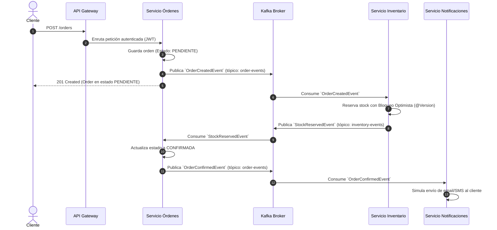
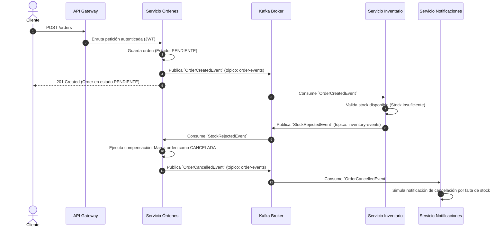

# Especificación de Eventos y Contratos (Fase 0)

Este documento define la arquitectura orientada a eventos (**Event-Driven Architecture**) y el patrón **Saga Coreografiada** utilizado en OrderFlow para coordinar transacciones de negocio entre los microservicios sin acoplamiento síncrono.

---

## 1. Topología de Tópicos Kafka

| Tópico | Productor Principal | Consumidores | Particionamiento (`Key`) |
| :--- | :--- | :--- | :--- |
| `order-events` | `orders-service` | `inventory-service`, `notification-service` | `orderId` |
| `inventory-events` | `inventory-service` | `orders-service` | `orderId` |

> **Garantía de orden:** Al utilizar `orderId` como clave de partición (`Kafka Message Key`), se garantiza que todos los eventos relativos a un mismo pedido lleguen estrictamente en orden a la misma partición.

---

## 2. Flujo de Transacciones Distribuidas (Saga)

### 2.1 Caso de Éxito (Happy Path)



---

### 2.2 Caso de Fallo y Compensación (Stock Insuficiente)



---

## 3. Estructura Estándar del Sobre (Event Envelope)

Todos los eventos publicados en Kafka comparten metadatos estándar de trazabilidad y tipado:

```json
{
  "eventId": "f47ac10b-58cc-4372-a567-0e02b2c3d479",
  "eventType": "OrderCreatedEvent",
  "timestamp": "2026-09-25T17:50:00Z",
  "aggregateId": "order-1001",
  "payload": { ... }
}
```

---

## 4. Contratos de Eventos (Esquemas de Payload)

### 4.1 `OrderCreatedEvent`
* **Emitido por:** `orders-service` al crear un pedido en estado `PENDIENTE`.
* **Consumido por:** `inventory-service`.

```json
{
  "eventId": "b3e9b089-2bf3-4e4b-9e4a-4a6c8e3e4a01",
  "eventType": "OrderCreatedEvent",
  "timestamp": "2026-09-25T17:50:00Z",
  "aggregateId": "ord-88392",
  "payload": {
    "orderId": "ord-88392",
    "userId": "usr-1204",
    "items": [
      {
        "productId": "prod-101",
        "quantity": 2,
        "unitPrice": 49.99
      },
      {
        "productId": "prod-204",
        "quantity": 1,
        "unitPrice": 120.00
      }
    ],
    "totalAmount": 219.98
  }
}
```

---

### 4.2 `StockReservedEvent`
* **Emitido por:** `inventory-service` tras descontar exitosamente el stock.
* **Consumido por:** `orders-service`.

```json
{
  "eventId": "c71a39d4-631d-44a6-9efb-22db14f3c702",
  "eventType": "StockReservedEvent",
  "timestamp": "2026-09-25T17:50:01Z",
  "aggregateId": "ord-88392",
  "payload": {
    "orderId": "ord-88392",
    "reservationId": "res-9941",
    "items": [
      {
        "productId": "prod-101",
        "quantityReserved": 2
      },
      {
        "productId": "prod-204",
        "quantityReserved": 1
      }
    ]
  }
}
```

---

### 4.3 `StockRejectedEvent`
* **Emitido por:** `inventory-service` si al menos un producto no cuenta con existencias suficientes.
* **Consumido por:** `orders-service`.

```json
{
  "eventId": "e932b144-8849-43a1-9a7c-bb62d2948710",
  "eventType": "StockRejectedEvent",
  "timestamp": "2026-09-25T17:50:01Z",
  "aggregateId": "ord-88392",
  "payload": {
    "orderId": "ord-88392",
    "reason": "INSUFFICIENT_STOCK",
    "failedProducts": [
      {
        "productId": "prod-101",
        "requestedQuantity": 2,
        "availableQuantity": 1
      }
    ]
  }
}
```

---

### 4.4 `OrderConfirmedEvent`
* **Emitido por:** `orders-service` al confirmar la orden tras recibir `StockReservedEvent`.
* **Consumido por:** `notification-service`.

```json
{
  "eventId": "f1a2384a-34dc-4b71-b08e-161bca796031",
  "eventType": "OrderConfirmedEvent",
  "timestamp": "2026-09-25T17:50:02Z",
  "aggregateId": "ord-88392",
  "payload": {
    "orderId": "ord-88392",
    "userId": "usr-1204",
    "status": "CONFIRMADA",
    "totalAmount": 219.98
  }
}
```

---

### 4.5 `OrderCancelledEvent`
* **Emitido por:** `orders-service` al cancelar la orden por compensación tras recibir `StockRejectedEvent`.
* **Consumido por:** `notification-service`.

```json
{
  "eventId": "da8f7739-813c-41ad-b13c-333e6fa39211",
  "eventType": "OrderCancelledEvent",
  "timestamp": "2026-09-25T17:50:02Z",
  "aggregateId": "ord-88392",
  "payload": {
    "orderId": "ord-88392",
    "userId": "usr-1204",
    "status": "CANCELADA",
    "reason": "INSUFFICIENT_STOCK"
  }
}
```

---

## 5. Idempotencia y Resiliencia en el Consumidor

1. **Clave de Idempotencia:** Cada consumidor debe registrar el `eventId` procesado en su tabla local (o caché Redis con TTL) para evitar procesamiento duplicado ante reintentos de Kafka (*At-least-once delivery*).
2. **Desacoplamiento Estricto:** Cada servicio deserializa estos JSONs en sus propias clases internas (Consumer-Driven Contracts), garantizando que cambios no disruptivos no requieran redeploys simultáneos.
